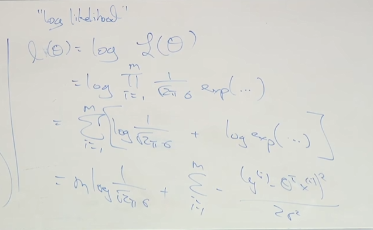
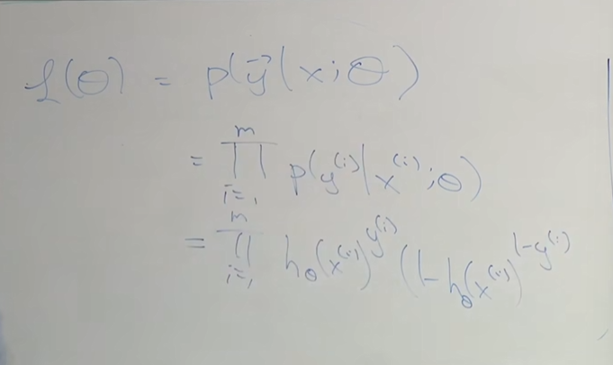
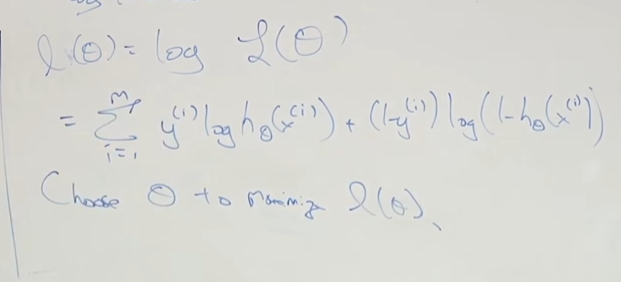
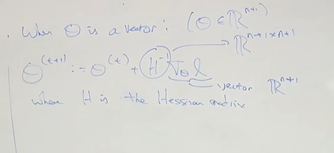

# 03
今天主讲局部加权线性回归去拟合非线性的方程，以及逻辑回归，牛顿逻辑回归，以及线性回归的概率解释
## 局部加权回归
 对于不可以线性回归的数据，我们可以采取如下措施：
###  一、改变特征  
比如说将$X_{2}$修改为$\sqrt{X_{2}}$,从而返回第一个线性回归方程  
### 二、局部加权线性回归和局部加权回归  
局部加权回归(locally weight regression)  
机器学习中分为参数学习算法和非参数学习算法，但是在参数学习算法中，适合于我们拥有固定的数据集，可以边做边删除这样。  
如果输入h去预测x，对于线性回归来说，就是拟合$\theta$，使得$\min_\text{成本函数}$  
但对于局部加权回归，就是在x附近的数据集进行训练。
成本函数修正为：  $\sum_{i=1}^m\omega^{(i)}(y^{(i)}-\theta^{T}x^{(i)})^{2}$其中$\omega$为权重。  
$\omega^{(i)}=exp(-\frac{(x^{(i)}-x)^{2}}{2})$ 
局部线性回归限制（也是大部分学习算法的限制）：往往只能在数据集内进行内推，外推误差将会极大。  

## 对于误差项为什么采用平方误差
在上一堂课中，遗留问题，损失函数为什么不选择四次方亦或绝对值  
今天将阐述逻辑回归。  
假设数据集中符合$y^{(i)}=\theta^{T}x^{(i)}+\varepsilon^{(i)}$，其中$\varepsilon$称为噪音。  
同时假设$\varepsilon$服从标准正态分布，这表示为$P(\varepsilon^{(i)})=\frac{1}{\sqrt{2\pi}}exp(-\frac{(\varepsilon^{(i)})^{2}}{2\sigma^{2}})$  
同时假设IID(independently,identically distributed)即独立同分布    
因此可得$P(y^{(i)}|x^{(i)};\theta)=\frac{1}{\sqrt{2\pi}\sigma}exp(-\frac{(y^{(i)}-\theta^{T}x^{(i)})^{2}}{2\sigma^{2}})$(可以联系到计量经济学),这里面的$\theta$指的是参数化该概率。  
the likelihood of theta定义为数据的概率，$f(\theta)=P(y|x;\theta)=\prod_{i=1}^{n}p(y^{(i)}|x^{(i)};\theta)$,参数的likelihood等同于数据的概率  
用最大似然估计求解似然函数：

在似然估计的最终求解，也是一个平方的形式，因此选择平方项作为误差。  

## Classification分类问题（二进制分类）  
在这一部分数据集中，$y_{i}\in(0,1)$  
如果采取线性回归的方法，那么可以将0.5设置为一个阈值，大于0.5则为1，小于0.5则为0，解决该二分类问题。  
但是这并不是一个好的方法，易受异常值影响。  
### Logistic Regression(逻辑回归或者是对数回归)  
want:   $h_{\theta}(x)\in[0,1]$  
$h_{\theta}(x)=g(\theta^{T}x)=\frac{1}{1+e^{-\theta^{T}x}}$  
$g(z)==\frac{1}{1+e^{-z}}称为$sigmoid\logistic function  
假设：数据具有如下分布：  
$P(y=1|x;\theta)=h_{\theta}(x)$  
$P(y=0|x;\theta)=1-h_{\theta}(x)$  
因此合并成如下方程组：  
$P(y|x;\theta)=h_{\theta}(x)^{y}(1-h_{\theta}(x))^{1-y}$  
继续使用最大似然估计法进行参数估计：  

  
为使似然函数最大化，因此我们采取梯度上升方法：  
$\theta_{j}=\theta_{j}+\alpha\frac{\partial}{\partial\theta_{j}}J(\theta)$  

### 牛顿法
我们需要梯度下降多次迭代才能趋近收敛，但是采取牛顿法将会快速达到收敛。  
即有一个函数$f$,参数为$\theta$，约束条件为$f(\theta)=0$  
在逻辑回归中，我们想要最大化似然函数，那么可以等效于求解其导数为0  
即为$\theta=\theta-df(\theta)/diff(df(\theta))$  
牛顿法具有二次收敛性质  

黑森矩阵定义为导数矩阵  
牛顿法的缺点是在高维问题中，如果$\theta$是一个向量，那么反转它的成本将会极高，经验法则，如果小于五十个参数可以选择牛顿法迭代。