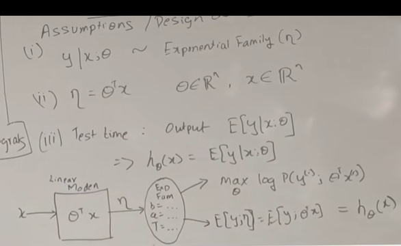
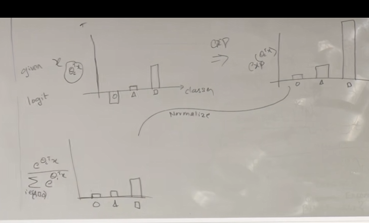
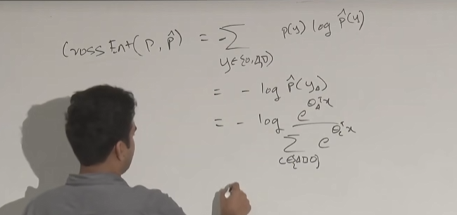

# 04
2025.9.13开始lecture4的学习。  
## 感知机模型以及广义线性回归模型 (GLM) 
激活sigmoid函数  
$g(x)=\begin{cases}1&\text{if }x>0\\0&\text{if }x=<0\end{cases}$  
$h_{\theta}(x)=g(\theta^{T}x)$  
感知器的参数更新：  
$\theta_{j}=\theta_{j}+\alpha(y^{(i)}-h_{\theta}(x^{(i)}))x_{j}^{(i)}$  
通过改变$\theta$本质上就是旋转坐标轴，更新分界线。 
但其只有几何上的解释，难以达成在概率上的解释，因此应用较小 
### 指数族(Exponential Family)
指数族是一种概率模型:  
$P(y;\eta)=b(y)exp[\eta^{T}T(y)-a(\eta)]$  $\eta$指的是自然参数   
$T(y)$为y的充分统计量  
$a(\eta)$为对数分割函数  
为什么采取指数族（指数族性质）：  
1.在极大似然估计中，该函数为凸函数  
2.对于每个分布，y的期望值是$\frac{\partial a(\eta)}{\partial\eta}$  
3.每个分布的方差为$\frac{\partial a(\eta)}{\partial\eta}$的二阶导  
若有真实连续数据任务，则用高斯概率密度  
若有分布任务则用伯努利概率密度  
若有离散值则用泊松分布    
### GLM
GLM 有些像指数族的自然延伸  
假设：  
1.$y|x;\theta:\text{为指数族}$  
2.$\eta=\theta^{T}x,$  $\theta\in\R^{n}$  
3.假设给我们一定的x进行预测，我们将输出其期望值。  

通过线性模型输出一个$\eta$，再通过分布函数去计算其期望值。  
然后通过梯度下降法去学习$\theta$参数，最大化概率密度函数的对数  
学习过程为：$\theta_{j}=\theta_{j}+\alpha(y^{(i)}-h_{\theta}(x^{(i)}))x_{j}^{(i)}$  等同于感知机模型的损失函数。  
  $\eta$$\to$自然参数  
  $E[y;\eta]=g(\eta)\to$规范响应函数  
  其反函数为规范连接函数  
该模型有三个参数：  
1.模型参数$\theta$这是通过学习获得的  
2.自然参数$\eta$  
3.规范参数$\phi$、$\mu$、$\sigma$  
### softmax regression/交叉熵最小化  
在这个问题中假设为多分类问题  
多分类问题中label y会设置成类似于独热编码。  
在这里面可以将$\theta$设置为一个矩阵，在不同的$\theta$组中，可以有效的将这个都分类好（可以简易为，多次循环回归得出参数拼接到矩阵当中）  
  
学习方法就是为使得两个分布之间交叉熵最小
