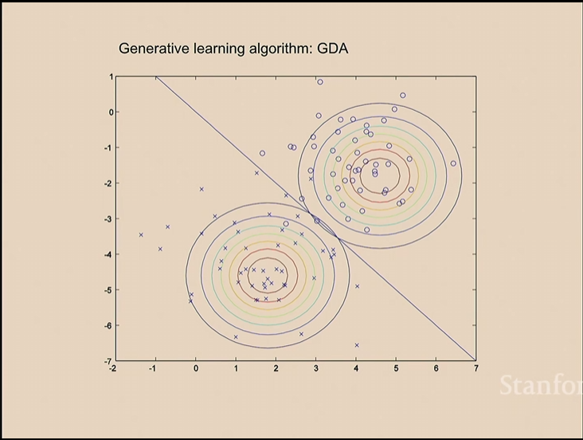
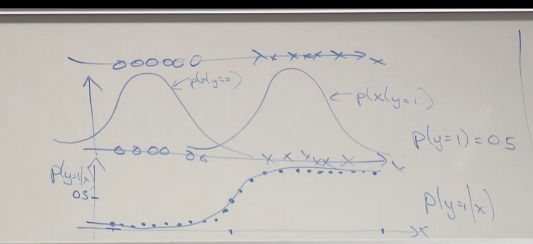
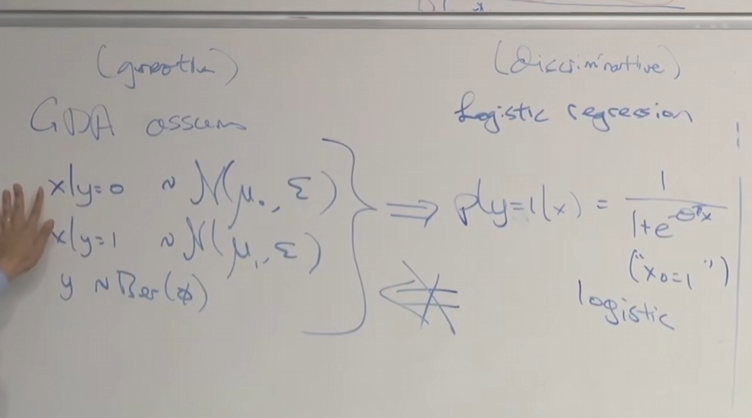
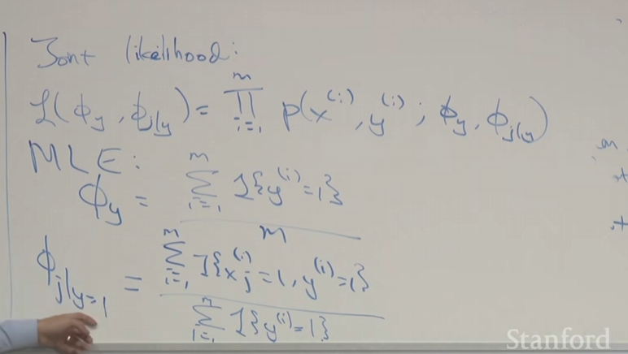

# 04  

2025.9.15

## GDA（高斯判别分析）

在此之前我们学习的都是判别式学习算法，今天开始学习生成式学习算法。

相比于logistic 回归，高斯判别分析将会简单一些同时在某些情况下会更有效，之后我们会学习朴素贝叶斯。

在前面所学的回归中，我们都是通过梯度下降法去寻找一条足以分开二者的线性函数。  

生成式学习算法没有去寻找这一条直线，划清两者的边界线，然后判断新的更接近于哪一个。  

分类算法：去寻找$P(y|x)$

生成算法：寻找$P(x|y)$

$P(y)$称为先验概率

通过贝叶斯规则：$P(y=1|x)=\frac{P(x|y=1)P(y=1)}{P(x)}$

因此得：$P(x)=P(x|y=1)P(y=1)+P(x|y=0)P(y=0)$

### GDA模型

其中$x\in\R^{n}$,同时并不需要$x_{0}=1$

关键假设：$P(x|y)$的分布是多元高斯分布(多元正态分布)

$\lambda \sim N(\vec{\mu},\sigma)$

$E(Z)=\mu$

高斯密度函数如下所示：
$$
P(z)=\frac{1}{(2\pi)^{\frac{1}{2}}\lvert\sigma\rvert^{\frac{1}{2}}}exp(-\frac{(x-\mu)^{T}\sigma^{-1}(x-\mu)}{2})
$$
$P(x|y=0)=\frac{1}{(2\pi)^{\frac{1}{2}}\lvert\sigma\rvert^{\frac{1}{2}}}exp(-\frac{(x-\mu_{0})^{T}\sigma^{-1}(x-\mu_{0})}{2})$

$P(x|y=1)=\frac{1}{(2\pi)^{\frac{1}{2}}\lvert\sigma\rvert^{\frac{1}{2}}}exp(-\frac{(x-\mu_{1})^{T}\sigma^{-1}(x-\mu_{1})}{2})$

$P(y)=\phi^{y}(1-\phi)^{1-y}$

假设有如下训练集：

${(x^{(i)} ,y^{(i)})}_{i=1}^{m}$

构造其似然函数(在分类问题中选择$\theta$假设其为条件似然函数)：
$$
\ell(\phi,\mu_{0},\mu_{1},\sigma)=\prod_{i=1}^{m}P(x^{(i)} ,y^{(i)} ,\phi,\mu_{0},\mu_{1},\sigma)\\
=\prod_{i=1}^{m}P(x^{(i)}|y^{(i)})P(y^(i))
$$
因此使用最大似然估计函数：
$$
max_{\phi,\mu_{0},\mu_{1},\sigma} \ \ \ \ \ell(.....) \\ \text{同时显而易见}\ \ \ \
\phi=\frac{\sum_{i=1}^{m}y^{(i)}}{m} \\
\mu_{0}=\frac{\sum_{i=1}^{m}x^{(i)} \ \ \ <if\ \ y^(i)=0>}{number(y^(i)=0)}
$$
协方差矩阵确定该椭圆形的走向。  

接下来若要做出预测行为，即求出：$max_{y} \ \ P(y|x)= \  \ argmax_{y}\frac{P(x|y)P(y)}{P(x)}$

但因为已知$P(x)$分布函数，因此其为一个常数，所以即求$argmax_{y} \ \ \ \ P(x|y)P(y)$

如果为了输出一个概率，那么需要将概率归一化之后进行输出。

### 比较GDA与Logistic回归

在GDA两种的交界处，难以界定其具体为哪一类。

如果将概率归一化之后会发现其概率最终会形成一个sigmoid函数：

Logistic回归和GDA都是在应用S型函数，这两种算法都提出了不同的决策边界。

但是为了比较二者的优劣，

相比而言，GDA提出了更为苛刻的假设。因此其要根据模型实际情况去判断自己使用哪一种算法。

若假定概率服从泊松分布或者是其他指数族，那么需要再次进行分析，但是如果是Logistic回归，则不需要考虑其是否符合那些指数族，但是对于逻辑回归的参数计算将会占用更多的时间，需要多次迭代，在GDA中，仅需要计算其协方差矩阵。

### 朴素贝叶斯

exp：垃圾邮件分类

如何将邮件表示为特征向量，表示某个单词是否在邮件中存在，将邮件表示为一个伯努利的向量。

$x\in {\{0,1}\}^{n}$

因此会有$x_{i}=\{1,0,.....\}$

因此$x$会有$2^{10000}$种可能

链式法则(第二行是通过条件独立假设）：

$P(X_{1},X_{2}.....X_{10000}|y)=P(X_{1}|y)P(X_{2}|y,X_{1})....P(X_{10000}|y,X_{1},X_{2}....X_{9999})\\=P(X_{1}|y)P(X_{2}|y)....P(X_{10000}|y)$

该模型参数：

$\phi_{j|y=1}=P(x_{j}=1|y=1)$

$\phi_{j|y=0}=P(x_{j}=1|y=0)$

$\phi_{j}=P(y=1)$

接下来构建最大似然函数：

$\ell(\phi_{y},\phi_{j|y})=\prod_{i=1}^{m}P(x^{(i)}, y^{(i) }; \phi_{y},\phi_{j|y})$

但是其弊端为，在某些情况下会出现为0的方程，因此应当引入拉普拉斯平滑去修正。