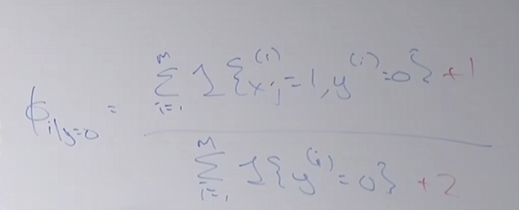
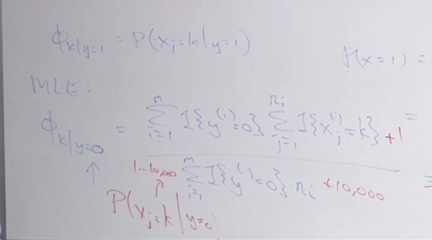

# 06

2025.9.16 开始进行lecture 06的学习

## 笔记

今天将讲述拉普拉斯平滑方法以及支持向量机

### 拉普拉斯平滑(应用于多元伯努利模型)

背景引入：

通过极大似然估计有如下式子：
$$
P(y=1|x)=\frac{P(x|y=1)P(y=1)}{P(x|y=1)P(y=1)+P(x|y=0)P(y=0)}
$$
当某个指标$x$从未出现过时，分子$P(x|y=1)=0$，同时有$P(x|y=0)=0$，所以该式成为一个零比零型，失去其应有的预测意义。导致朴素贝叶斯崩溃 

拉普拉斯平滑：

假设一支球队一直输下去，连输四场，我们对于其下一场胜利估计，正常为：
$$
P(y=1)=\frac{\sum y=1}{\sum y=1 +y=0}=0
$$
但是这在统计学种显然不符合常理，因此拉普拉斯平滑就是将二者都加一，对于未知事件重置为$\frac{1}{2}$可能性

即修改为：
$$
P(y=1)=\frac{\sum y=1+1}{\sum y=1 +y=0+1+1}=\frac{1}{6}
$$
对于二分类算法，可以使用如下变化方法：

当连续特征值$x_{i}\in \lbrace1,2,3,...k \rbrace$

其中有效的方法就是将其设置区间，如$1\sim100$,相当于新设立一个特征

### 多项事件模型

当某种文本数据，出现多次单词时，在原先模型中我们对于其向量依旧是保持为1，这将损失其信息量，因此我们应当对其增加权重。如：Drugs!Buy drugs now!

修改特征向量为$x\in \begin{bmatrix}1600 \\ 800 \\ 1600 \\6200\end{bmatrix}\in\R^{n}$

$x_{j}\in \lbrace 1,....10000 \rbrace$

$n=length(x_{j})$

$P(x,y)=P(x|y)P(y)$

假设：=$\prod_{j=1}^{n} \ P(x_{i}|y)P(y)$

其参数与之前相同:

$\phi_{y}=P(y=1),\phi_{k|y}=P(x_{j}=k|y=0)$

### 