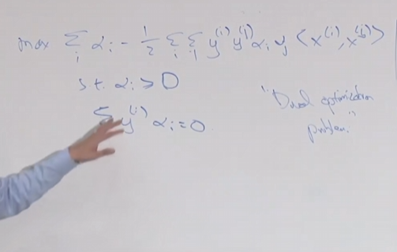
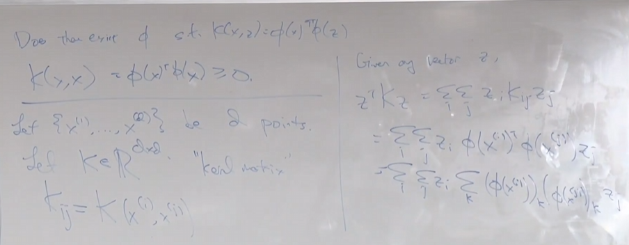
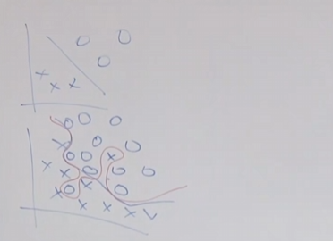

# 07

2025.9.20开始lecture07学习

## 支持向量机

假设数据为线性可分

我们目的是最大化间隔，即$min\ \  \ \eta=y_{i}(\omega^{T} x_{i}+b)$

同时:$max \ \ \varLambda=\frac{\eta}{\|\omega\|}$

我们的目标就是：$max_{\omega,b} \  \ \ \varLambda$

subject to：$y_{i}(\omega^{T} x_{i}+b) \ge 1$

同时转换优化目标，如若优化曲线已经确定，那么就去选择其最大软距离$max \ \ \frac{1}{\|\omega\|}$

即$min \ \ \frac{1}{2}\|\omega\|^{2}$

我们假设：$x^{(i)}\in \R^{100}$

$\omega=\sum_{i=1}^{M}\alpha_{i}y^{(i)}x^{(i)}$该假设正确。可以通过由多个训练集样本点确定决策边界，假设只有两个点，那么你的决策边界就已经确定了。

$\omega$是一个垂直于决策边界的一个向量

因此目标函数变为：
$$
min \ \ \frac{1}{2}(\sum_{i=1}^{m}\alpha_{i}y^{(i)}x^{(i)})^{(T)}(\sum_{i=1}^{m}\alpha_{i}y^{(i)}x^{(i)})\\ 
=min \ \ \frac{1}{2}\sum_{i=1}^{m}\sum_{j=1}^{m}\alpha_{i}\alpha_{j}x^{(i)^{T}}x^{(j)}y^{(i)}y^{(j)}\\
=min \ \ \frac{1}{2}\sum_{i=1}^{m}\sum_{j=1}^{m}\alpha_{i}\alpha_{j}<x^{(i)},x^{(j)}>y^{(i)}y^{(j)}
$$

$$
subject\ to:\\y^{(i)}((\sum_{j=1}^{M}\alpha_{j}y^{(j)}x^{(j)})x+b)\ge1\\
y^{(i)}((\sum_{i=1}^{M}\alpha_{i}y^{(i)}x^{(i)})+b)\ge\varLambda
\\ \text{同时定义内积:}<x_{i},x_{j}>
$$

对偶优化问题

对于一个新的预测：$h_{\omega,b}=g(\omega^{T}x_{i}+b)$

####  kernel核方法

<1>已经表示出$\omega$由$<x^{(i)},x^{(j)}>$决定，那么可以将此转换到更高的维度

<2>构造映射关系$x\to\phi(x)$,可以由低维转到高维

<3>找到一种计算$K(x,z)=\phi(x)^{T}\phi(z)$

<4>替代算法中的$<x,z>$

但是会增加时间复杂度。

比如说在显示映射中(如多项式映射)：时间复杂度将会增加

但如果是直接设置一个核函数：$K(x,z)=g(x,z)$那么就可以直接绕过$\phi(x)$和$\phi(z)$

##### 如何设定核函数

①如果x,z是相近的，那么他们内积将会极大

②如果x,z是不同的，那么内积将会小一些

高斯核函数：$K(x,z)=exp(-\frac{\|x-z\|^2}{2\sigma^2})$根据x,z距离决定核函数大小

基本满足：①$K(x,x)=\phi(x)^{T}\phi(x)\ge0$

### 软间距算法（L1算法）

在模型中，我们假设数据都是线性可分的，但是很难做到

在上述中$y^{(i)}(\omega^{T}x^{(i)}+b)$为几何距离

因此可放松假设：$y^{(i)}(\omega^{T}x^{(i)}+b)\ge1-\xi_{i}$

同时增添限制：$\xi_{i}\ge0$

因此目标函数改为：$min \ \ \frac{1}{2}\|\omega\|^{2}+C\sum_{i=1}^{m}\xi_{i}$