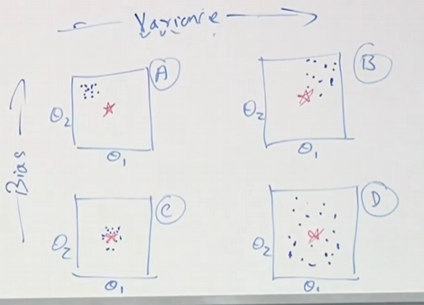
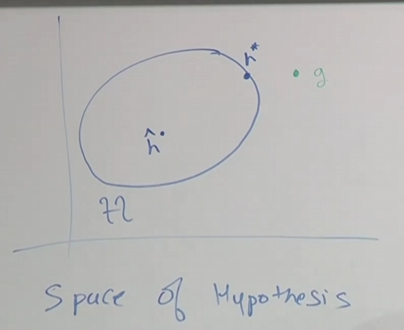
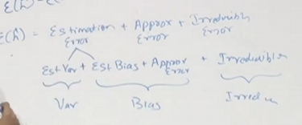
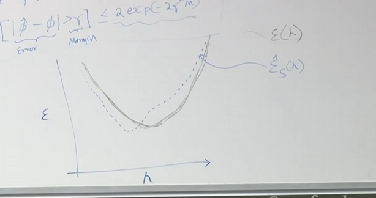
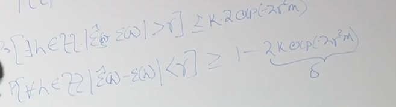
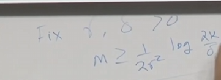

# 09

2025.9.22

## 笔记

主要内容在于学习的假设，偏差，泛化的原因，收敛性。

#### 假设（Assumption）

两个假设：

①存在如下分布D：$(x,y)\sim D$,我们的数据是来源于同一分布。

②所有样本都是独立采样 

#### 偏差方差

偏差是估计参数离实际参数的距离

方差是估计参数距离其自身的距离。当我们采取正则化的时候，方差将会减少。

统计有效性：当$m\to \infty$ $\ \ \ var[\hat{\theta}]\to 0$$ \ \ \ \hat{\theta}\to{\theta}$，则称其为一致性算法。$E[\hat{\theta}]=\theta$

如果一个模型偏差极大，即为不具备有效性的算法，即使数据量极大也会有极大的偏差。

Fighting Variance：

①提高数据量使得，$m\to \infty$

②正则化（但会导致有效性丧失一点）

这是在给定数据集中分布情况，g为真实分布，H为通过学习算法可以得到的分布$\hat{h}$，是该空间中一个，该空间内因为噪声而导致的误差$\varepsilon(h)$称为风险和泛化误差。

$\varepsilon(h)=E_{(x,y)\sim D}[l \lbrace h(x)\ne  y\rbrace]$，这是趋于无穷的情况下。

$\hat{\varepsilon}$称为经验风险即我们自己有限数据集中，犯错的概率。

$\varepsilon(g)$称为贝叶斯误差，即为不可避免的误差（比如说有的相同x但是输出不同y）

$\varepsilon(h^{\star})-\varepsilon(g)$ 称为近似误差(Approximation Error),可以理解为模型之间的误差

$\varepsilon(\hat{h})-\varepsilon(h^{\star})$ 称为估计误差(Estimation error)，这是数据的误差

显然，$\varepsilon(\hat{h})=\text{贝叶斯误差+近似误差+估计误差}$

对于高偏差：

①更换模型，增大h，比如说增添正则化

#### 经验风险最小化(ERM)

ERM是一种学习算法

目标函数为：$arg\underset{h\in H}min\ \ \ \frac{1}{M}\sum_{i=1}^{M}\lbrace h(x^{(i)})\ne y^{(i)}\rbrace$

研究的两大问题：

①$\hat{\varepsilon}(h)$vs$\varepsilon(h)$

②$\varepsilon(\hat{h})$vs$\varepsilon(h^{\star})$

两大工具去解决：①联合约束②霍夫丁不等式（Hoeffding)

##### 联合约束

假设有如下事件$A_{1},A_{2}....A_{n}$并不要求独立，那么$P(A_{1}\cup A_{2}....\cup A_{n})\le P(A_{1})+....P(A_{n})$

##### 霍夫丁不等式

假设有$Z_{1},Z_{2},.....Z_{m} \sim Bino(\phi)$，设$\hat{\phi}=\frac{1}{m}\sum_{i=1}^{M}Z_{i}$

假设有$r>0$,称为间距(margin)

$P[|\hat{\phi}-\phi|>r]\le 2exp(-2r^{2}M)$

结论如下：对于样本量M做出该约束

