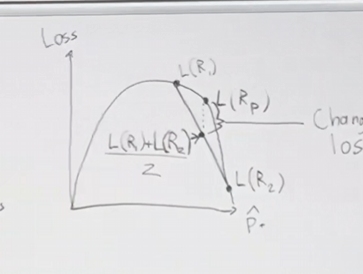

# 10

2025.9.22

## 笔记

决策树及集成方法的学习。

### 决策树

决策树为一个非线性的模型。决策树是一个高方差的模型

贪心，自上而下的递归是决策树的两大特点。

明白了决策树的决策过程，重点在于如何确定决策点

#### 区域损失

$define\ \ \ L(R)$

$\hat{p_{i}}$为R中样本作为最常见类的概率

$L_{minloss}=1-max \ \ \hat{p_{c}}$

误分类率(Misclassification Loss)目标函数：$max \ \ \ \Delta =L(P)-(L(C_{1})+L(C_{2}))$

如果 $\Delta > 0$，说明划分让模型更纯净（更好）。

如果 $\Delta \leq 0$，说明划分没有带来好处，就不会选它。

交叉熵损失：$L_{cross}=-\sum \hat{p_{c}}log_{2}\hat{p_{c}}$

假设分类过程中分出的数量相等，则有如下映射关系：

#### 基尼损失

$Gini=\sum \hat{p_{c}}(1-\hat{p_{c}})$

#### 回归树

假设要在$R_{m}$中获得预测值$\hat{y_{i}}$

预测值为$\hat{y_{m}}=\frac{\sum_{i\in R_{m}}y_{i}}{|R_{m}|}$

损失值(方差)：$\frac{\sum_{i\in R_{m}}(y_{i}-\hat{y_{m}})^{2}}{|R_{m}|}$

#### 多种类拆分

假设有9种类型

- 每个类别可以分配到 **左子集** 或 **右子集**，所以一共有 $2^q$ 种分法。

- 但是：

  - 把所有类别都放到左边或右边是无意义的（不算真正划分）。
  - 左右对称的划分（例如“红蓝 | 绿黄”和“绿黄 | 红蓝”）本质上是一样的。

- 因此真正不同的划分数是：
  $$
  2^{q-1} - 1
  $$

$q=9$ 时，理论划分数为 $2^9 = 512$，实际不同划分为 $2^{8}-1=255$

#### 正则化

用启发式方法去做

- 限制叶子数量（如果叶子数量小于4则停止）
- 设置最大深度
- 相关节点排序最大数
- 最小化损失
- 剪枝 （通过验证集误分类率去判断剪枝）

#### 时间复杂度

假设拥有n个样本，每个样本有f个特征，深度为d

测试时长显然为，O(d)，其中$d<log_{2}n$

训练时长：

- 每个节点都是O(d)的时间复杂度

- 划分节点，需要有O(f)的时间复杂度去选取特征

因此总的训练时长O(nfd)

#### 优缺点

优点：

- 对于各个分支易解释
- 可以处理分类变量
- 运行速度快

缺点：

- 高方差
- 在可加性环境下表现很差
- 预测正确率低

可以通过集成的方法去对决策树进行扬长避短。

## 集成学习方法

我们在进行模型的时候都有IID假设，放弃独立性假设，因此我们变量都有ID假设

$corr(x)=P$

$var(\bar{X})=p\sigma^{2}+\frac{1-p}{n}\sigma^{2}$

#### 集成方法

虽然时间上增加但是会有极好的效果

- 不同的算法
- 不同的训练集
- Bagging(Random Forest)
- Boosting($Adaboost,xgboost$)

重在最后两个

##### Bagging

本质上是依靠Boostsrap采样

引导样本Z，从原本样本中抽取N次。

方差偏差理论：通过增加n减少方差，但会增加偏差。

因此和决策树互补