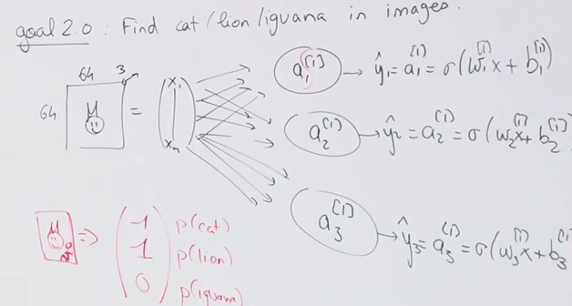
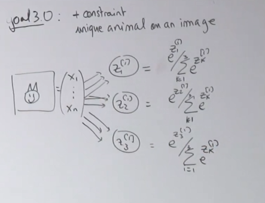
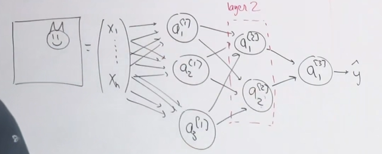

# 11

2025.9.25

## 笔记

今天将讲述神经网络和深度学习

逻辑回归可以迁移到神经网络模型。

深度学习是一种机器学习技术，专门处理一些高复杂度大数据问题。

### 逻辑回归

目标1:达成一个二分类问题，去判断某个是否为1。

一张图片往往需要$64*64*3$元素，3是指RGB

提取图片，进行向量化$\to$神经元($\omega x+b$)$\to\hat{y}=\sigma(\theta^{T}x)=\sigma(\omega x+b)$ $x$是一个(64* 64* 3，1)的矩阵，那么$\omega$为(1,64* 64* 3)

实施过程：①初始化$\omega,b$

②探寻最优解$\omega,b$，那么意味着要定义一个损失函数(即为逻辑回归的损失函数)

③实现预测

神经元就等于$linear+activation$线性加激活

模型=架构+参数

目标2:在一张图片中找到多种动物(多分类问题)

方法：设置多个神经元，在不同的神经元中各个参数所对应的权重不同。

$\begin{bmatrix}1\\0\\1\end{bmatrix}$ 神经网络将对你所设置的数据标签进行训练

> 鲁棒性的探讨：

> > 神经网络模型只注意得到0与1，彼此神经元之间是相互独立的。

新的目标:对于图像上独特动物的约束，确保某些图像上只有一种动物

使用softmax公式：去做多分类问题，这样可以作为每个的概率输出

因此这称为softmax多分类神经网络

输入：$\begin{bmatrix}1\\0\\0\\\end{bmatrix}\begin{bmatrix}0\\0\\1\\\end{bmatrix}$

> 为什么要这样输入
>
> ## 为什么 softmax 的标签输入要是 `[1,0,0]` 而不是 `[1,1,1]`？
>
> - **softmax 的基本假设**：它是一个 **单标签多分类模型**，即“一次输入对应唯一正确的类别”。
>   - 举例：一张图片要么是猫，要么是狗，要么是兔子 → 只能有一个对。
>   - 所以标签必须是 **one-hot 向量**，比如猫就是 `[1,0,0]`，狗就是 `[0,1,0]`。
> - 如果你用 `[1,1,1]`：
>   - 意味着这张图 **同时属于三类**。
>   - softmax 会被迫输出一个概率分布（和为 1），但是标签 `[1,1,1]` 并不是一个概率分布（和 = 3）。
>   - 交叉熵损失就没有合理意义了 → 它要求标签是分布，才能度量分布间差异。
>
>    换句话说，**softmax 多分类必须是 mutually exclusive（互斥的类别）**。

因此我们要修改损失函数即将三类进行加和$L_{3n}=\sum_{k=1}^{3}[y_{k}log\hat{y_{k}}+(1-y_{k})log(1-\hat{y_{k}})]$

即选取概率最大的。

在深度学习中，我们必须要修改损失函数，采取的是交叉熵的方法

$L_{3n}=-\sum_{k=1}^{3}y_{k}log\hat{y_{k}}$

> 为什么采用交叉熵方法：
>
> 但是在 softmax 框架下，这样写有两个问题：
>
> ### (1) **冗余且难以计算梯度**
>
> - softmax 的输出 $\hat{y}_k$ 之间是耦合的（分母有求和）。
>
> - 如果继续用 $(1-y_k)\log(1-\hat{y}_k)$ 这种写法，梯度推导会变得非常复杂。
>
> - 相反，直接用：
>   $$
>   L = -\sum_{k=1}^K y_k \log \hat{y}_k
>   $$
>   就简单得多，因为 one-hot 标签里只有一个分量是 1，损失函数就是 “-log 预测的正确类别概率”。
>
> ### (2) **数值稳定性和优化效率**
>
> - softmax + cross-entropy 结合后，梯度有个非常简洁的形式：
>   $$
>   \frac{\partial L}{\partial z_j} = \hat{y}_j - y_j
>   $$
>   也就是“预测概率 - 真实标签”。
>
> - 这个形式非常简单，能避免很多数值计算问题（比如梯度爆炸/消失），并且大幅提升训练效率。
>
>    所以，**交叉熵损失并不是随便定义的，而是和 softmax 结合后能得到极简的梯度公式**，这就是深度学习中常说的 “牵一发而动全身”。

如果要预测猫的年龄，那么还是要用最后一种网络(可能用加权)

ReLU函数=$\begin{cases}x \ \ \ x>0\\0\ \ \ x<0\end{cases}$

修改损失函数

### 神经网络

#### 一、检测是否有猫

增加参数，增加神经元

参数增加的并没有多少$3*n+3+2*3+2+2*1+1$

我们将第一层定义为输入层，中间的作为隐藏层，最后一层作为输出层。

全连接层（FC 层）是神经网络中最基本的一层，它的特点是：

- **上一层的每一个神经元**，都会和 **下一层的每一个神经元** 建立连接。
- 每条连接都有一个独立的权重参数（weight），并且每个神经元还有一个偏置项（bias）。

黑箱模型，因为当你设置每个神经元的时候，你并不知道神经元它所代表的是什么。

#### 二、反向传播及优化

如何去优化$\omega^{[1]},\omega^{[2]},b^{[1]},b^{[2]}$

定义损失函数及成本函数

成本函数：$H(y,\hat{y})=\frac{1}{M}\sum_{i=1}^{M}L^{(i)}$

因为我们要进行批次梯度下降

损失函数:$L^{(i)}=-[y_{k}log\hat{y_{k}}+(1-y_{k})log(1-\hat{y_{k}})]$

计算成本函数和损失函数关于某个参数的导数本质上是等价的

对于每一层

$\omega^{[i]}=\omega^{[i]}-\frac{\partial J}{\partial \omega^{[i]}}$

$b^{[i]}=b^{[i]}-\frac{\partial J}{\partial b^{[i]}}$

从哪个导数开始优化，实则要从最后一个向前进行优化，通过微积分的链式法则可以逐渐向前求导。