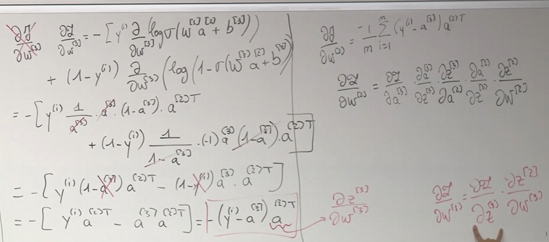
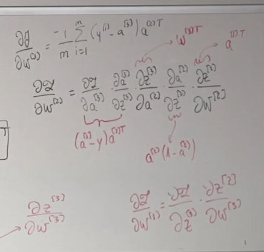
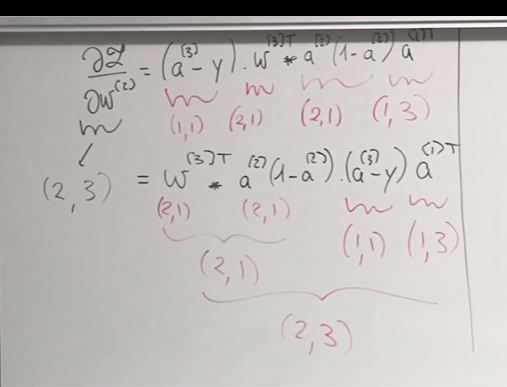

# 12

2025.9.27开始lecture12的学习

## 笔记

第二次深度学习

### 神经网络反向推导技巧

定义成本函数：$J(\hat{y},y)=\frac{1}{m}L(\hat{y},y)$

最终端的损失函数为：$L^{(i)}=-[y^{(i)}log\hat{y}^{(i)}+(1-y^{(i)})log(1-\hat{y}^{(i)})]$(交叉熵损失函数)

$\frac{\part J}{\part\omega^{{3}}}=-[y^{(i)}\frac{\partial (log \sigma(\omega^{[3]}a^{[2]}+b^{[2]}))}{\partial \omega^{[3]}}+(1-y^{(i)}) \frac{\partial (log (1- \sigma(\omega^{[3]}a^{[2]}+b^{[2]})))}{\partial \omega^{[3]}}]$

最终可以化简为：$-[y^{(i)}(1-a^{[3]})a^{(2)T}-(1-y^{(i)})a^{[3]}a^{(2)T}]=-[y^{(i)}a^{(2)T}-a^{[3]}a^{(2)T}]=-(y^{(i)}-a^{[3]})a^{[2]T}$
$$
\frac{\part J}{\part\omega^{{3}}}=-\frac{1}{m}\sum_{i=1}^{m}(y^{(i)}-a^{[3]})a^{(2)T}
$$






### 提升改善神经网络

不断进行更新的环节未必是会有很好的结果，因为很难达到最好的情况。

引进ReLu函数和tanh函数$tanh(x)=\frac{e^{z}-e^{-z}}{e^{z}+e^{-z}}$

sigmoid函数相比的优势在于给予一个象征概率的数字，但是对于其尾部，当z极大或者是极小的时候，梯度会很小，所以难以进行梯度更新。若在网络中较早出现，那么将导致整个网络难以更新。

ReLu则保持梯度一致，都是1或0.在神经网络中大部分都是用ReLu

### 为什么我们需要激活函数

如果没有激活函数：$\hat{y}=W^{[3]}a^{[2]}+b^{[3]}=W^{[3]}W^{[2]}(W^{[1]}x+b^{[1]})+W^{[3]}b^{[2]}+b^{[3]}$

那么我们的函数就等效于线性回归，因此网络的复杂性来源于激活函数。

#### 对于数据预处理：

假设我们拥有如下数据$x=\begin{Bmatrix}x_{1}\\ x_{2}\end{Bmatrix}$

如果数据及其分散，那么可能将导致z值过大，梯度失效，因此要对x进行预处理，$x=\frac{x-\mu}{\sigma}$

#### 消失和爆炸的梯度：

假设有二维输入$x=\begin{Bmatrix}x_{1}\\ x_{2}\end{Bmatrix}$，同时有极深的网络。

假设初始bias为0，如果初始化$\omega$为$\begin{bmatrix}1.5\ \ 0\\0\ \ 1.5\end{bmatrix}$那么最终初始的$y=\omega^{n}x$将会梯度爆炸，同时梯度下降极难。

如果为$\begin{bmatrix}0.5\ \ 0\\0\ \ 0.5\end{bmatrix}$那么最终将会趋向于0，梯度下降也难。

所以对于$\omega$初始化为1附近

同时还有另一种方法，$a=\omega(z)\\z=\omega_{1}x_{1}+...+\omega_{n}x_{n}$因此可以初始化各个$\omega$为$\frac{1}{n}$

在numpy中：

```
w=np.random.randn(shape)*np.sqrt(1/n)
```

这对于sigmoid非常有效

对于ReLu函数：

```
w=np.random.randn(shape)*np.sqrt(2/n)
```

- Xavien Initialization:

​            对于tanh：$\omega^{(l)}\sim \sqrt{\frac{1}{n^{[l-1]}}}$

- He initialiaztion:

​                                $\omega^{(l)}\sim \sqrt{\frac{2}{n^{[l]}+n^{[l-1]}}}$

### 优化及正则化:

如果对于每个参数都是初始化同一个数值，难免会出现学习相同的情况，因此我们将使神经元从不同的地方开始，并让它们独立进化。

因此要么进行正则化或者是优化。

优化问题中权衡批次梯度下降和随机梯度下降，比如小规模梯度下降结合随机梯度下降去优化。

假定有$X=(x^{(1)},x^{(2)}.....x^{(n)},)$

$Y=(y^{(1)},y^{(2)}.....y^{(n)})$

选定T批x:$x=(x^{1},x^{2}...x^{T})$

其中$x^{1}$指的是$(x^{(1)}.....x^{(1000)})$

用部分梯度下降估计全体:$J=\frac{1}{1000}\sum_{i=1}^{1000}L^{(i)}$

#### 动量-动量算法(也称动量-梯度下降)：

