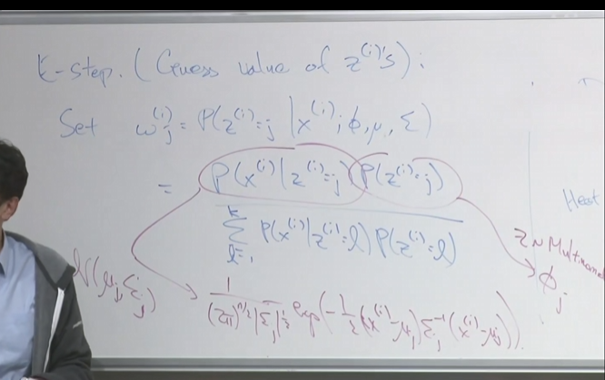

# 14

2024.9.28

## note

EM算法，是一种无监督学习的方法。

### k-means聚类：

常见的k-means算法选定簇质心进行未标签的数据的划分。

随机寻找簇质心$\to$改变簇质心为该分类均值$\to$重复此操作直至收敛

质心更新值$\mu_{j}=\frac{\sum_{i=1}^{m}1\lbrace c^{(i)}\rbrace x^{{i}}}{\sum_{i=1}^{m}1\lbrace c^{(i)}=j \rbrace}$

成本函数为:$J(c,\mu)=\sum_{i=1}^{m}||x^{(i)}-\mu_{c^{(i)}}||^{2}$,由于其为二次函数，因此可以认为其必收敛。

但其往往会出现陷入局部最优点，因此可多次尝试寻找合理的簇。

#### Density estimation密度估计：

可以应用于异常估计，例如:$P(x)<\varepsilon$

往往数据并没有教科书上的函数族建模，因此可以拟合高斯函数建模，以簇中心为$\mu$，成本函数为其方差。构建一个概率密度分布。

### EM算法和最大化估计：

混合高斯模型：

与高斯判别GDA不同的为混合高斯模型中的种类$z$

假设我们通过聚类方法已知z的种类，因此可以用最大似然估计进行参数估计：

$L(\phi,\mu,\varepsilon)=\sum_{i=1}^{m}log\ p(x^{(i)},z^{(i)},\phi,\mu,\varepsilon)$

易知：$\phi_{j}=\frac{1}{m}\sum_{i=1}^{m}1\lbrace z^{(i)}=j\rbrace$

$\mu_{j}=\frac{\sum_{i=1}^{m}1 \lbrace z^{(i)}=j\rbrace x^{(i)}}{\sum_{i=1}^{m}1\lbrace z^{(i)}=j\rbrace}$

#### EM算法：

我们不知道z值，因此将猜测z的值

E这一步也称为期望步骤设置为$\omega_{j}^{(i)}=P(z^{(i)}=j|x^{{i}};\phi,\mu,\xi)$

=$\frac{P(x^{{i}}|z^{(i)}=j)P(z^{(i)}=j)}{\sum_{t=1}^{k}P(x^{(i)}|z^{(i)}=t)P(z^{(i)}=t)}$

Mstep为是用最大似然估计 