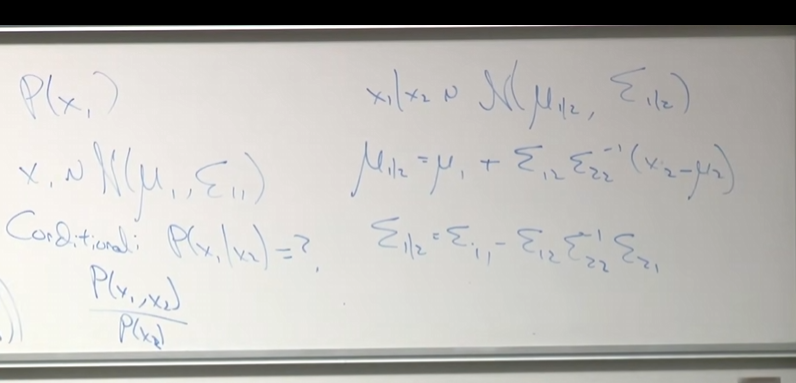
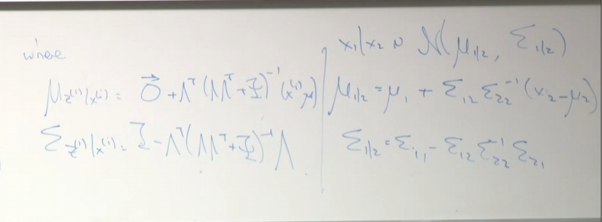
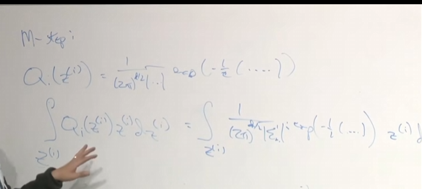

# 15

2025.9.29进行lecture15的学习。

## 笔记

主要讲述因子分析模型

### 因子分析

在因子分析模型中，z的值不是离散的而是连续分布的，因此对于求和概率将成为一个积分。

$J(\theta,Q)=\sum_{i}\sum_{z^{(i)}}Q_{i}(z^{(i)})log\frac{P(x^{(i)},z^{(i)};\theta)}{Q_{i}(z^{(i)})}$

在m(数据量)>>n(特征数量)时,运用高斯没有问题，但是高斯模型对于初值的设定极其敏感。

> 比如说对于30个人进行100个问题的心理测试

当数据量和特征值差距不大的时候，当m<n时，协方差矩阵将为一个奇异矩阵。

因为在EM算法中对于$\sigma$的更新为$\sigma=\frac{1}{m}\sum_{i=1}^{m}(x^{(i)}-\mu)^{2}$

概率密度为：$\frac{1}{(2\pi)|\varepsilon|^{\frac{1}{2}}}exp(.....\varepsilon^{-1}...)$因为协方差矩阵为极小值，所以高斯概率曲线将为无限扁长。

- 选择1：对于协方差矩阵可以设置一些为0(假设仅有对角矩阵)。限制高斯分布非扁平。 
- 选择2：约束$\Sigma=\sigma^{2}I$，限制高斯曲线为圆形.$\sigma=\frac{1}{m}\frac{1}{n}\sum\sum_{i=1}^{n}(x^{(i)}-\mu^{(i)})^{2}$某种意义上来说是朴素贝叶斯的一种变形

机器学习世界终究是小数据的世界，比如说小于1000，对于几百例样本进行推断

$P(x,z)=P(x|z)P(z)$,z是隐藏要素,$z\sim N(x,I)$

$x=\mu+\lambda z+\varepsilon$,因此有$x\sim N(\mu+\lambda z,\sigma)$

### EM结合因子分析：

假定$x\sim \R^{n}$,$x\sim N(\mu,\Sigma)$

高斯边际条件分布应由联合分布取出。

假定P(x,z),$\begin{pmatrix}z\\ x \end{pmatrix}\sim N(\mu_{x,z},\Sigma)$

$z\sim N(0,I)$,$E(z)=0$

$x=\mu+\lambda z+\varepsilon$,$E(x)=\mu$

$\mu_{x,z}=\begin{bmatrix}0\\ \mu \end{bmatrix}$

$\Sigma=\begin{bmatrix}\Sigma_{11}\ \Sigma_{12}\\\Sigma_{21}\ \Sigma_{22}\end{bmatrix}$

$\begin{bmatrix}x\\z\end{bmatrix}\sim N(\begin{bmatrix}\mu\\0\end{bmatrix},\begin{bmatrix}I\ \ \lambda^{T}\\z\ \ \lambda\lambda^{T}+I\end{bmatrix})$

#### E-step:

$Q_{i}(z^{(i)})=P(z^{(i)}|x^{(i)};\theta)$

$P(z_{(i)}|x^{(i)})$就可求

所做的就是将上图中左侧两行所储存。

#### M-step:

在这一步中将会从简单的加总变为了积分。

